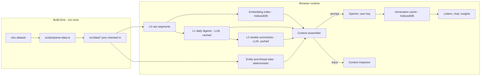

# Nirva Deep-Dive Demo — Technical Architecture

This document defines HOW the app is built: stack, data flow, module contracts, and shared types. Parallel agents must build against the interfaces defined here so their work integrates cleanly. See `01-product-spec.md` for product/UX requirements and `03-build-guide.md` for execution.

## Stack

- **Vite + React 18 + TypeScript + Tailwind CSS** — pure SPA, zero server
- **react-router-dom** — client-side routing
- **Recharts** — charts
- **@xyflow/react** (React Flow) — relationship graph (Coming Soon)
- **idb** — thin IndexedDB wrapper
- **OpenAI API, direct browser fetch** — `gpt-4o-mini` for generation, `text-embedding-3-small` for embeddings. No SDK needed; plain `fetch` keeps the bundle small.
- Deployed to Vercel as static output (existing Git-connected project; see Deployment below)

## Data flow



## Repository layout

```
scripts/
  parse-data.ts          # one-off: xlsx -> src/data/*.json (run with tsx; xlsx dep is devDependency)
src/
  data/
    segments.json        # 823 typed segment records (checked in)
    derived.json         # per-day aggregates, intentions, people, threads (checked in)
  types.ts               # ALL shared types below live here (single source of truth)
  lib/                   # small pure helpers (dates, formatting, colors)
  llm/
    client.ts            # OpenAI fetch wrapper + key management
  memory/
    store.ts             # IndexedDB: digests, embeddings, generation cache, chat history
    embed.ts             # batch embedding + cosine retrieval
    assemble.ts          # context assembler -> { prompt, trace }
    generate.ts          # task orchestration: daily letter, weekly letter, chat answer
  components/            # shared UI: NavBar, Card, EmotionChip, KeyPrompt, BreathingLoader, charts
  pages/
    DayView.tsx
    MonthView.tsx
    Chat.tsx
    MemoryExplainer.tsx
    ComingSoon.tsx       # + subcomponents: RelationshipGraph, HabitChecker, ExportDelete
  App.tsx                # router + nav shell
  main.tsx
vercel.json              # framework: vite + SPA rewrite
```

Keep every file under ~300 lines; split subcomponents rather than growing page files.

## Shared types (`src/types.ts` — single source of truth)

```ts
export interface EmotionLabel { label: string; confidence: number }

export interface Segment {
  id: string;              // "2026-05-11#001" — date + zero-padded index within day
  date: string;            // "2026-05-11"
  day: string;             // "Mon"
  time: string;            // "06:55"
  transcript: string;
  emotions: EmotionLabel[]; // [] when no clear signal (~80% of rows)
  pitchHz: number;
  loudnessDb: number;
  speakingRateSps: number;
  prosody: number;         // 0..1 expressiveness
  pauseFreqMin: number;    // pauses per minute
}

export interface DayAggregate {
  date: string;
  day: string;
  segmentCount: number;
  emotionCounts: Record<string, number>;   // label -> count
  dominantEmotion: string | null;
  // hour-bucketed acoustic means for the energy arc chart
  hourly: { hour: number; pitch: number; loudness: number; prosody: number; speakingRate: number; count: number }[];
  meanProsody: number;
  meanPitch: number;
}

export interface Intention {
  key: string;             // canonical id, e.g. "dentist"
  label: string;           // "Book the dentist"
  segmentIds: string[];    // every resurfacing, chronological
  status: 'kept' | 'drifting' | 'dropped';  // determined in parse script
}

export interface Person {
  key: string;             // "sam"
  name: string;            // "Sam"
  relation: string;        // "partner" | "co-founder" | "designer" | "prospective hire" | ...
  segmentIds: string[];    // segments mentioning them
}

export interface Thread {
  key: string;             // "fundraise"
  title: string;           // "The raise"
  description: string;
  segmentIds: string[];    // key moments, chronological
}

export interface DerivedData {
  days: DayAggregate[];
  intentions: Intention[];
  people: Person[];
  threads: Thread[];
  weeks: { index: number; start: string; end: string; dates: string[] }[]; // 4 weeks
}

// ---- memory / generation ----

export type GenTask =
  | { kind: 'dailyLetter'; date: string }
  | { kind: 'weeklyLetter'; weekIndex: number }
  | { kind: 'chat'; question: string; mode: 'companion' | 'therapist'; history: ChatMessage[] };

export interface ContextItem {
  type: 'segment' | 'dailyDigest' | 'weeklySummary' | 'entity';
  refId: string;                // segment id, date, week index, or entity key
  text: string;                 // exactly what went into the prompt
  reason: string;               // human-readable: "similarity 0.83" | "same day" | "entity: Sam"
  tokens: number;               // estimate (chars/4 is fine)
}

export interface ContextTrace {
  task: GenTask;
  items: ContextItem[];
  systemPrompt: string;
  tokenBudget: number;
  tokensUsed: number;
  timestamp: number;
}

export interface ChatMessage {
  role: 'user' | 'assistant';
  content: string;
  citations?: string[];         // segment ids backing the answer
}
```

## Module contracts

Parallel agents build against these signatures. Do not change them without updating this doc.

### `src/llm/client.ts`
```ts
export function getApiKey(): string | null;              // localStorage 'nirva_openai_key'
export function setApiKey(key: string): void;
export function clearApiKey(): void;
export async function chatCompletion(opts: {
  system: string; messages: { role: string; content: string }[];
  temperature?: number; maxTokens?: number;
}): Promise<string>;                                      // gpt-4o-mini
export async function embedTexts(texts: string[]): Promise<number[][]>;  // text-embedding-3-small, batched <= 100/request
```
Throws a typed `LlmError` with a friendly message on 401/429/network; UI shows it inline, never crashes.

### `src/memory/store.ts` (IndexedDB db name `nirva-memory`, version 1)
Object stores: `embeddings` (key: segment id), `generations` (key: cache key), `chatHistory` (key: auto).
```ts
export async function getCachedGeneration(key: string): Promise<{ text: string; trace: ContextTrace } | null>;
export async function putGeneration(key: string, value: { text: string; trace: ContextTrace }): Promise<void>;
export async function getAllEmbeddings(): Promise<Map<string, number[]>>;
export async function putEmbeddings(entries: [string, number[]][]): Promise<void>;
export async function exportAll(): Promise<Blob>;         // full JSON dump (segments + derived + IDB contents)
export async function hardDelete(): Promise<void>;        // deletes the DB + clears nirva_* localStorage keys
export async function getMemoryStats(): Promise<MemoryStats>; // keys-only counts (embeddings, digests, letters, chat) for the Memory Explainer
```
Generation cache keys: `daily:2026-05-11`, `weekly:0`; chat turns are not cached (but history persists in `chatHistory`).

### `src/memory/embed.ts`
```ts
export async function ensureEmbeddings(segments: Segment[], onProgress?: (done: number, total: number) => void): Promise<Map<string, number[]>>;
export function topKSimilar(queryVec: number[], index: Map<string, number[]>, k: number): { id: string; score: number }[];
```
`ensureEmbeddings` is idempotent: loads from IDB, embeds only what's missing (823 segments ≈ one-time, pennies), stores back.

### `src/memory/assemble.ts`
```ts
export async function assembleContext(task: GenTask): Promise<{ prompt: string; system: string; trace: ContextTrace }>;
```
Assembly policy (also documented for the user in the Memory Explainer page):
- **dailyLetter**: all segments of that date verbatim (a day fits comfortably: ~30 segments), plus the previous day's digest if cached, plus intentions/threads touching that date. Budget ~6k tokens.
- **weeklyLetter**: the 7 daily digests of that week (generate any missing digests first — a "daily digest" is a compact 3–5 sentence LLM summary per day, cached under `digest:<date>`), plus thread states, plus a few high-signal segments (emotion-tagged) from the week. Budget ~6k tokens.
- **chat**: embed the question, retrieve top-12 segments by cosine similarity, merge with entity match (if a known person/thread keyword appears in the question, include their top segments), plus the current day-range framing. Budget ~5k tokens. Every retrieved segment id becomes an eligible citation.
- The trace records every item with its reason and token estimate. `putGeneration` persists text + trace; the Memory Explainer reads the latest trace (keep a `latestTrace` in a module-level store or IDB).

### `src/memory/generate.ts`
```ts
export async function getDailyLetter(date: string): Promise<{ text: string; trace: ContextTrace }>;   // cache-first
export async function getWeeklyLetter(weekIndex: number): Promise<{ text: string; trace: ContextTrace }>;
export async function askChat(question: string, mode: 'companion' | 'therapist', history: ChatMessage[]): Promise<ChatMessage>;
```
Chat answers must end with a machine-readable citation line the client parses: `[[cite:2026-05-11#004,2026-05-12#010]]` (strip from display, render as chips).

### System prompt registers (keep in `assemble.ts`)
- **Daily/weekly letters**: warm, second person, letter-like, concrete — quotes 1–2 short verbatim phrases, notices without diagnosing, never bullet points, never "as an AI."
- **Companion chat**: grounded factual recall over the retrieved context; must cite; admits when the answer isn't in memory.
- **Therapist mode**: reflective reframing — connects feelings, language, and acoustic patterns across time into novel interpretations; gentle, non-clinical, asks at most one question back; still cites.

## Data pipeline (`scripts/parse-data.ts`)

Run once via `npx tsx scripts/parse-data.ts`; outputs are checked in so the app never parses xlsx and builds never need the script.

1. Read `context/nirva_self_audio_month (1).xlsx` (dep: `xlsx`, devDependency). Sheet `audio_notes`, 823 rows. Columns map 1:1 to `Segment` (collapse `emotion_1..3` + confs into `emotions[]`, dropping nulls).
2. Emit `src/data/segments.json`.
3. Compute `src/data/derived.json` (`DerivedData`):
   - `days`: per-day aggregates including hourly acoustic means
   - `people`: keyword match on names — Sam, Daniel, Mira, Adrian (word-boundary, case-insensitive) with relation labels
   - `threads`: curated keyword sets, e.g. fundraise (`raise|raising|investor|pitch|deck|term sheet|fund`), battery (`battery|BLE|radio|power|drain|charge`), orb (`orb|shader|Metal|glow|breath`), hiring (`Adrian|hire|hiring|candidate|recruit`), sam (`Sam`)
   - `intentions`: keyword/regex extraction for recurring self-promises (dentist, protein, accountant/calendar, walk/reset, groceries...) with `status` derived from whether later segments show completion language
   - `weeks`: 4 Monday-start weeks over 2026-05-11 → 2026-06-07

Keyword lists are tuned against the real transcripts while writing the script — verify counts look sane (e.g. dentist should appear 4+ times, Sam should be the most-mentioned person).

## Routing & shell

Routes: `/` → redirect `/day/2026-05-11`; `/day/:date`; `/month`; `/chat`; `/memory`; `/future`.
`App.tsx` renders NavBar + `<Outlet/>`; a single `DataProvider` context loads `segments.json` + `derived.json` once (static imports — they're bundled) and exposes them via a `useData()` hook.

## No-key behavior

`useApiKey()` hook exposes key state reactively. Components that need generation render `<KeyPrompt/>` (elegant inline card with a password input, "stored only in your browser" note) when the key is absent. All deterministic views work without a key.

## Deployment

Existing Vercel project **nirva-health** (Hobby team), Git-connected to `shaan-m-patel/Nirva-Health`, branch `main`, root `./`. Every push to `main` auto-deploys. The project was imported with the Create React App preset, so the repo must include:

```json
// vercel.json
{
  "framework": "vite",
  "rewrites": [{ "source": "/(.*)", "destination": "/index.html" }]
}
```

No environment variables on Vercel — the OpenAI key is user-supplied at runtime.
