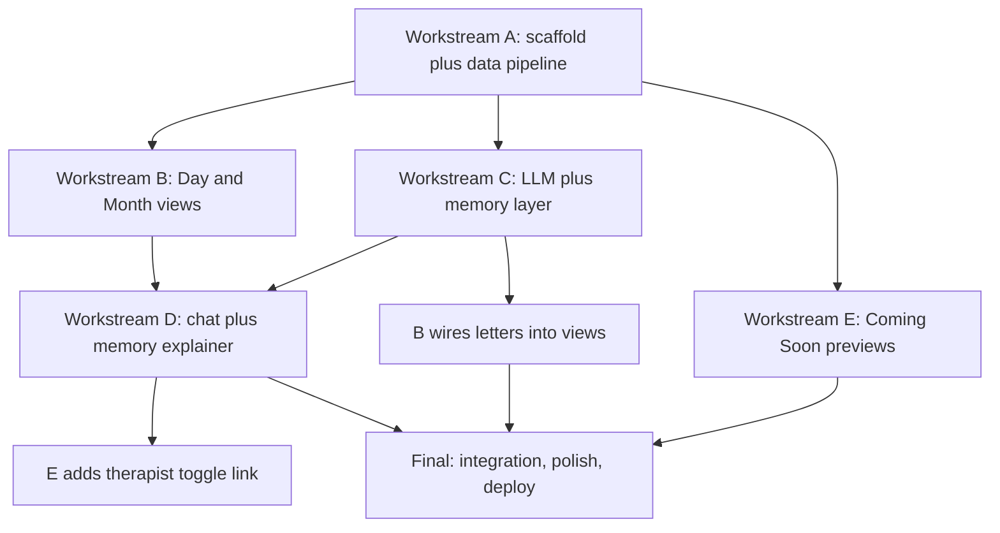

# Nirva Deep-Dive Demo — Build Guide

This document defines the execution plan: workstreams, their dependency order, per-workstream deliverables and acceptance criteria, and conventions every agent must follow. Read `01-product-spec.md` (what/UX) and `02-architecture.md` (how/contracts) first — this doc assumes both.

## Ground rules for every agent

- **Contracts are law.** Types in `src/types.ts` and module signatures in `02-architecture.md` are the integration boundary. If a change is unavoidable, update `02-architecture.md` in the same commit.
- **No mock data, no placeholders.** Everything renders from `src/data/segments.json` / `derived.json`. If your workstream depends on generation and you have no API key, build against the no-key state — never stub fake letters.
- **Files < 300 lines.** Split subcomponents instead of growing files.
- **Match the design language** in `01-product-spec.md` (palette, type, spacing, motion). No dark backgrounds, no visual clutter. When in doubt: calmer, quieter, more whitespace.
- **Verify before finishing:** `npm run build` must pass with zero TypeScript errors; check your pages in the dev server.
- Total budget is ~6 wall-clock hours with workstreams running in parallel. Stay at preview fidelity where the spec says preview.

## Dependency graph

Workstreams B, C, E run fully in parallel once A lands. D starts when C's `generate.ts` and B's page shells exist.

## Workstream A — Scaffold + data pipeline (~1h, blocks everything)

Deliverables:
1. Vite + React + TS app (`npm create vite@latest . -- --template react-ts`), Tailwind configured with the design tokens (extend theme: brand colors, Sora/Manrope + letter-body font families via Google Fonts `<link>` in `index.html`).
2. Dependencies: `react-router-dom`, `recharts`, `idb`, `@xyflow/react`; dev: `xlsx`, `tsx`.
3. `src/types.ts` copied exactly from `02-architecture.md`.
4. `scripts/parse-data.ts` per the pipeline spec; run it; check in `src/data/segments.json` + `src/data/derived.json`.
5. Router shell: `App.tsx` with NavBar (wordmark + pill links: day / month / chat / memory / future), routes with lazy-loaded placeholder pages, `DataProvider` + `useData()`.
6. Shared components: `Card`, `EmotionChip`, `BreathingLoader`, `KeyPrompt` (visual shell; C wires the logic), page transition wrapper.
7. `vercel.json` (framework vite + SPA rewrite), `.gitignore`, `README.md` update (what this is, how to run, how the key works).

Acceptance: `npm run dev` shows the nav shell with all 5 routes; `segments.json` has 823 records; `derived.json` has 28 days, 4 weeks, ≥4 people, ≥4 threads, ≥4 intentions with sane counts (dentist ≥ 4 segments, Sam = most-mentioned person); build passes.

## Workstream B — Day view + Month view (~2.5h, after A)

Deliverables:
1. `pages/DayView.tsx` (+ subcomponents `SegmentTimeline`, `AcousticArc`, `IntentionsCard`, `DailyLetterCard`): day picker (28 days), letter column, timeline with emotion chips, hourly acoustic chart, intentions for that day. `DailyLetterCard` calls `getDailyLetter(date)` when the key exists, shows `KeyPrompt` otherwise, `BreathingLoader` while generating. Until C lands, code against the contract import — it will typecheck once C merges (coordinate on a shared branch or stub the module locally without committing stubs).
2. `pages/MonthView.tsx` (+ `WeeklyLetterCard`, `ThreadTimeline`, `EmotionHeatmap`, `PatternInsights`): 4 weekly letter cards (same key-gated pattern), thread arcs with clickable moments navigating to `/day/:date`, 28-day heatmap (deterministic: color by dominant emotion tint, intensity by mean prosody), pattern insight cards computed from `derived.json`.
3. Both pages fully match the design language; letters render in the ~720px reading column with the letter-body font.

Acceptance: without an API key, both pages are complete and beautiful except key-gated letter cards; navigation day↔month works; every chart uses real data; deep link `/day/2026-05-23` renders directly.

## Workstream C — LLM client + memory layer (~2.5h, after A)

Deliverables:
1. `llm/client.ts` per contract, including `useApiKey()` React hook and full `KeyPrompt` logic (save/clear, "stored only in your browser" note, link to OpenAI keys page).
2. `memory/store.ts` per contract (IDB `nirva-memory` v1; export/hardDelete included — E consumes them).
3. `memory/embed.ts`: idempotent `ensureEmbeddings` with progress callback, cosine `topKSimilar`.
4. `memory/assemble.ts`: the three assembly policies + three system-prompt registers from `02-architecture.md`; every call produces a full `ContextTrace`; expose `getLatestTrace()`/subscription so the explainer can render it live.
5. `memory/generate.ts`: cache-first `getDailyLetter` / `getWeeklyLetter` (weekly generates missing daily digests first), `askChat` with citation-line parsing (`[[cite:...]]`).

Acceptance: with a real key in the browser console/dev harness — a daily letter generates in <10s, caches (second call instant), and its trace lists that day's segments with reasons and token counts; embeddings build once with progress and are skipped next load; a chat call returns citations that map to real segment ids; 401 with a bad key surfaces a friendly inline error.

## Workstream D — Chat + memory explainer (~1.5h, after B shells + C)

Deliverables:
1. `pages/Chat.tsx`: message thread UI (user right / nirva left, calm styling), input, history persisted via `store.ts`, citation chips under each answer linking to `/day/:date` (highlight target segment via query param, e.g. `/day/2026-05-11?seg=2026-05-11%23004` — B's timeline should support `?seg=`; add it if missing). **Companion / Therapist toggle** (pill switch, therapist gets a slightly warmer accent tint) passing `mode` through to `askChat`.
2. `pages/MemoryExplainer.tsx` (+ `ArchitectureDiagram`, `ContextInspector`): a visual, interactive walkthrough of L0→L1→L2 + entities + embeddings (custom styled boxes/arrows are fine; hoverable explanations of keep-vs-drop policy: raw kept, digests compact, embeddings enable recall, nothing silently deleted), and the live inspector rendering the latest `ContextTrace` — items grouped by type, reason badges, token bar showing budget vs used. Empty state invites generating a letter first.

Acceptance: a chat question about the raise returns a grounded answer whose citations jump to the correct segments; toggling therapist mode changes the voice; after generating any letter, the inspector shows its actual trace with a correct token breakdown.

## Workstream E — Coming Soon previews (~1.5h, after A; parallel with B/C/D)

Deliverables — `pages/ComingSoon.tsx` with a short hero ("what nirva is growing toward") and four sections, each labeled "preview":
1. `RelationshipGraph.tsx`: React Flow — person nodes (draggable, sized by `segmentIds.length`, soft circular styling) around a center "you" node; edges labeled with mention counts; clicking a node/edge opens a side panel listing that person's real segments (time-stamped quotes, link to day).
2. `HabitChecker.tsx`: cards from `derived.json` intentions — label, resurfacing count, sparkline-ish dots across the 28 days for each resurfacing, status pill (kept / drifting / dropped).
3. Therapist mode teaser card → links to `/chat` with the toggle preset (query param `?mode=therapist`; D reads it).
4. `ExportDelete.tsx`: fully functional — Export calls `exportAll()` and downloads `nirva-export.json`; Hard delete confirms ("this erases everything nirva remembers — there is no undo") then calls `hardDelete()` and reloads. Frame both with the privacy copy: "your data belongs to you."

Acceptance: nodes drag smoothly; clicking Sam shows Sam's actual segments; dentist habit shows its 4+ resurfacings on the correct dates; export downloads a valid JSON containing segments + any cached generations; hard delete leaves the app in a clean first-visit state.

## Final integration + deploy (~1h, after B/C/D/E)

1. Cross-wire loose ends: `?seg=` highlighting, `?mode=therapist`, nav active states, page transitions, favicon + `<title>` ("nirva — a month, witnessed"), Google Fonts preconnect.
2. Visual QA pass on all five pages at 1440px and ~390px (mobile: nav collapses gracefully, letters stay readable).
3. `npm run build` clean; test `npx vite preview` including deep-link refresh (SPA rewrite locally means preview 404s are expected — verify rewrite config exists for Vercel instead).
4. Commit and push to `main` on `shaan-m-patel/Nirva-Health` → Vercel auto-deploys. If the build fails on Vercel because the project preset is still Create React App and `vercel.json` doesn't override it, switch the framework preset to Vite via the Vercel dashboard/MCP and redeploy.
5. Smoke-test the production URL: all routes load on refresh, key entry works, a letter generates end to end.

## Suggested commit/branch strategy

Single repo, short-lived branches per workstream (`ws-a-scaffold`, `ws-b-views`, ...) merged into `main` in dependency order (A first, then B/C/E in any order, then D, then final). If agents share one working tree sequentially instead, commit after each workstream's acceptance criteria pass. Do not push to `main` until the build is green — every push deploys.
